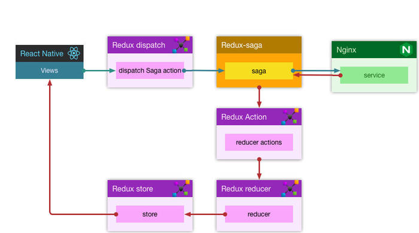
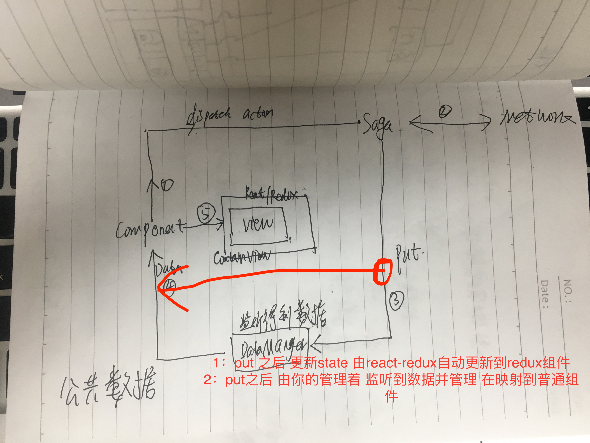
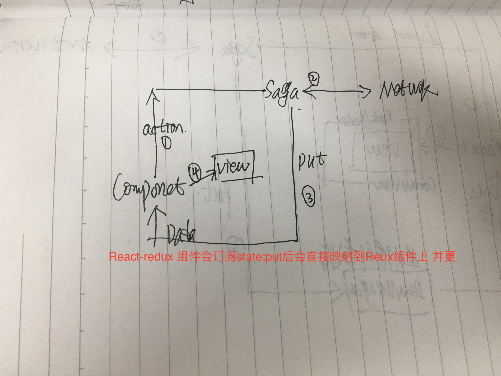

<a style="display:block;text-align:center">Redux-saga</a>
======

* 介绍

	```
	1：Sage是一个出路复杂的一步逻辑模块，由redux的action触发
	2： React展现数据
		Redux管理数据并绑定到React
		Sage处理业务
	3:适合比较复杂的应用  不然不需要
	```


* Saga
	
	```
		1:属于Redux的中间件 处理复杂的异步函数
		2:监听Redux的action 来触发Saga
		3:在不确定的情况下 劲量使用try/catch。保证调试工作
			如果yield new Promise() promise如果拒绝 要经常try处理
			
		4:所有操作都需要yield调用
			yeild call
			yeild new Promise() 直到被调用
		5:不要和Redux state有太多联系 
	```
* 简单的流程
	
	```
		1:配置好Saga
		2:注册Form提交Redux的Action 
		3:Saga监听到事件  触发逻辑
		4:请求到数据 在派发给Redux
		5:Redux 绑定到React
	```

* 集成
	
	```
	1:npm install --save redux-saga
	
	2:创建sagas文件件
	
	3:UserSagas.js
		function* userLogin(acc,pwd){
			const token = yeild call(obj,acc,pwd)
			return token
		}
		
		export function* UserSaga(){
			const {acc,pwd} = yeild take("USer_login");
			const token = yeild call(userLogin,acc,pwd)
			....
		}
		//结合Redux
		import createSagaMiddleware from 'redux-saga'
		import {UserSaga} from "../Sagas/UserSagas"
		export const SagaWare = createSagaMiddleware();
		export default Store = 
		createStore(APPReducers,applyMiddleware(logger,SagaWar))
		在合适机会
		SagaWare.run(SagaWare)
		
		SagaWare = function*(){
			yield fork(AccountSaga)
			yield fork(HomeSaga)
			yield fork(...Saga)
		}
		
		AccountSaga = func* (){
			while (true){
        		const action = yield take([Types.AccountTypes.login,Types.AccountTypes.register]);
        		switch(action.type){
            		case Types.AccountTypes.login:
                			yield put({type:Types.MessageType.loadingMessage,content:"登陆中。。。"});
			                const  success = yield call(UserLogin,action);
			                yield put({type:Types.MessageType.textMessage,content:success ? "成功" : "失败"});
          			      break;
		            case Types.AccountTypes.register:
       		         break;
            		default:
                		break;
        		}
	    	}
		}
		
	```
* 非堵塞(任务)

	```
		const task = yeild fork() //cancel(task)
		
		const task = yeild spawn()
			创建一个非堵塞的任务 
			该任务是独立的 和 当前任务无关（独立）（错误、取消 都是独立的）。
			
	```
* 多任务
	
	```
		const [a,b] = yeild [call(),take()]	
			得到所有都执行(有一个被拒绝), 才往下执行
			
		race 开启有多个任务 ，仅仅需要一个得到结果
			import { delay } from 'redux-saga'
			
			const {posts, timeout} = yield race({
				posts   : call(fetchApi, '/posts'),
				timeout : call(delay, 1000)
  			})
  			
			如果有一个执行，就不在阻塞。并且关闭其他任务
		all 并行完成 等待所有都完成
		
 		yeild = take(["","",""])
 			得到其中一个
 		
	```
* 并发
	
	```
		takeEvery("",func(action),...agrs) 每次监听到 都会执行func
			fork每个任务
			
		takeLatest("",func(action),...agrs) 每次监听到 会把之前的取消，在执行
			fork每个任务
		
			
	```
* API

	```
	let Saga = createSagaMiddleware(...sagas)
	Saga.run(RootSage,arg1,arg2...) 参数会传递到RootSaga
	
	pattern 和  Channel
		parttern 为action
		channel 是包装之后的type 一个可缓存的parttern
	
	生成effects
	effect =
		Promise
		* func{return Promise}
		* 
		put(pattern | Channel)
			pattern 派发action
			put(channel,action)向指定channel派发action
			
		take(pattern | Channel)
			pattern 等待action
			Channel 缓存多个action 如果有缓存 下次循环不再等待
		[ effect ]
		call(任意func)
		apply()
		fork()
		all()
		select()
		race()
		cancel()
		join()
		flush
		takeEvery
		takeLatest
		takeLeading
		throttle
		spawn()
		
		
	all([effect1,effect2]) 组合生成新的effect
	yeild effect; 执行effect
		
	
	delay(ms, [val])
		生成一个同步延迟effect
		
	take(ar)表示等待action触发 
		> "*" 或者 "ActionName" 
		> (action)=>{
			return bool
		  }
		> ["Name1",Name2]匹配到其中一个
		const action = yeild take("Name")
	
		
	put({action})
		传递一个action到Redux 的Store
		yeild put({type:"",id:"xxx"})
		
	call(func,args) 调用某个函数
		func* A(...){return any}
		func* B(...){yeild take(...)}
		const res = yeild call(A,....)
	apply(context,[....])
	
	select() 用于获取redux Store数据
		select(state=>state.user)
	
	fork() 和call类似 但是不会阻塞
		const res = yeild call(..)
		console.log(res)
		当call完成之后才会打印res
		
		const res = yeild fork()
		console.log(res)
		res会立刻打印 res 为 任务 Task
	
	cancel 取消task
		const task = yeild fork()
		
		yeild cancel(task)
		取消后会产生SagaCancellationException
		该错误不会向上冒泡
		
	select 这是saga 和 Redux 数据交互函数
		a.js getCart = state=>state.XX.oo
		
		saga.js const cart = yield select(getCart)
		
		分开写是为了降低saga 和 redux 和耦合度；
		数据变更后 只需要修改a.js即可
	all 会等待所有任务执行完成 解决集合返回
		all({xx:effect,oo:effect}) = {xx,oo}
		all([eff,eff]) = [eff,eff]
	race
		会等待全部完成 或者一个出现错误
	flush(channel)
		清空channel缓存的Action
		
	takeEvery 
		func*(action){}
		每次收到type执行saga (执行子saga期间依然可以接受type)
	takeLatest 
		func*(action){}
		收到type  会把之前的saga取消(没有完成的) 再次执行saga(执行子saga期间依然可以接受type)
	throttle
		节流
			控制saga触发次数 在执行后一段时间内 不在执行
	takeLeading 没有了
		等待派发action  执行saga 然后无视action 知道saga完成
		======等于
			yeild  fork(function*(){
				while(ture){
					let action = yeild take("type")
					yeild call(saga)
				}
			})
	
	Channel 队列 支持缓存
		while(true){
			yeild take("AType")等待dispatch任务
			yeild call()一个阻塞任务
		}
			dispatch一个Atype 就会被执行
			任务阻塞期间 其他的dispatch会被遗忘
		take(channel)
			任务阻塞期间 dispatch会被缓存
			下一个while循环 take不会等待直接执行
	
	actionChannel 生成 Channel
		包装action Type 生成一个可缓存action对象;如果当前有缓存个数
		
	eventChannel 一个工厂函数  生成一个Channel 
		用于吧redux action 以外的事件连接到saga上
		import { eventChannel, END } from 'redux-saga'
		let Achannel = evenChannel(emmter=>{
			
			return ()=>{
				该函数会在Achannel.close()后调用
				emmter(END)
			}
		})
		连接saga
		yeild take(Achannel)
		....
		
	channel 一个函数 用于生成默认Channel
		yeild call(chanel,..)
	```
* Channel
	* eventChannel (websock 连接到saga)
		
		```
			function CreateWebsocket(){
				let web = new WebSocket()
				return web
			}
				
			function CreateEventChannel(socket){
				return eventChannel(emmer=>{
				
					socket.onMessage("text",function(data){
						//发送到saga
						emmer(data)
					})
					return ()=>{
						socket.close()
					}
				},缓存数量,)
			}
			
			function * WebSage(){
				let socket = yeild call(CreateWebsocket)
				let channel = yeild call(CreateEventChannel,scoket)
				while(true){
					//接受到外部数据
					let data = yeild take(channel)
					yeild put({
						type:"",
						data
					})
				}
			}
		```
	* 节流 | 防抖动 | ajax 重试

		```
		
		```
	* Channel 保证最多三个同步任务
	
		```
			import { channel,buffers } from 'redux-saga'
			import { take, fork, ... } from 'redux-saga/effects'
			
			function * getNetData(channel){
				while(true){
					let action = yeild take(channel);
					let data = yeild call(networl);
					yeild put({
						type,
						data
					})
				}
			}
			function * GetXXInfoBox(){
				//创建任务队列
				let msgChannel = yeild call(channel)
				
				//开启三个任务
				yeild fork(getNetData, msgChannel)
				yeild fork(getNetData, msgChannel)
				yeild fork(getNetData, msgChannel)
				
				while(true){
					let action = yeild take("任务Type");
					//吧action 派发到指定队列中
					yeild put(msgChannel,action)
				}
			}
		```
	
* 对外输出 支持redux以外的事件处理
	
	```
		》默认saga  是和Redux 进行搭配的
		》如果没有Redux 或者自己实现消息转发
			import { runSaga } from 'redux-saga'
			function* saga() { ... }
			const myIO = {
			  subscribe: ..., // 用于解决 take Effects
			  dispatch: ...,  // 用于解决 put Effects
			  getState: ...,  // 用于解决 select Effects
			}
		
		
		//开启saga
		runSaga(
		  saga(),
		  myIO
		)
	```
* Saga 和 rxjs组合
	
	```
	yeild UserInfoManager.loginUser(action.Account,action.PassWord).toPromise();
	```
* 数据流程

	
	
	
* Dome

	```
	export function * SystemsMessagesFunction() {
    while (true){
        let action = yield take([Types.HomeTypes.SystemMessages,Types.HomeTypes.SystemOperation]);
        switch (action.type){
            case Types.HomeTypes.SystemMessages:
                try {
                    console.log("SystemMessages")
                    yield put({
                        type:Types.MessageType.loadingMessage
                    })
                    let result = yield  NetWorkManager.GET("message/system-message",null,{rows:action.row,page:action.index}).toPromise()
                    console.log(result)
                    yield put({
                        type:Types.MessageType.MessageDismiss
                    });
                    yield put({
                        type:Types.HomeTypes.SystemMessages,
                        Messages:result.success ? result.result :{}
                    });
                }catch (err){
                    console.log("加载SystemMessages失败",err)
                }
                break;
            case Types.HomeTypes.SystemOperation:
                try{
                    console.log("SystemOperation")
                    yield put({
                        type:Types.MessageType.loadingMessage
                    });
                    let result = yield  NetWorkManager.POST("equipment/deal-bind",null,{message_id:action.id,operate:action.status ? 1 : 0}).toPromise()
                    yield put({
                        type:Types.MessageType.textMessage,
                        content:result.success ? "操作成功" : "炒作失败"
                    });
                    
                    1:这里可以直接再次Type:SystemOperation
                    2:直接会触发监听函数
                    3:而不会再次触发Saga 流程是因为 代码走到这里 并没有回到yield take([Types.HomeTypes.SystemMessages,Types.HomeTypes.SystemOperation]);
                    
                    yield put({
                        type:Types.MessageType.SystemOperation,
                        info:result.result
                    })
                }catch (err){
                    console.log("SystemOperation",err)
                }
                break;
            default:
                break
        }
    }
    
    
    
    分派任务、监听数据
    _operation = (status)=>{
        //SystemOperation
        Store.dispatch({
            type:Types.HomeTypes.SystemOperation,
            status,
            id:this.state.info.id
        });
        this.unsunb = Store.subscribe(watch(Store.getState,"HomeReducer.SystemMessages.Operation")((_new)=>{
            console.log(_new)
        }))
    }
	```**